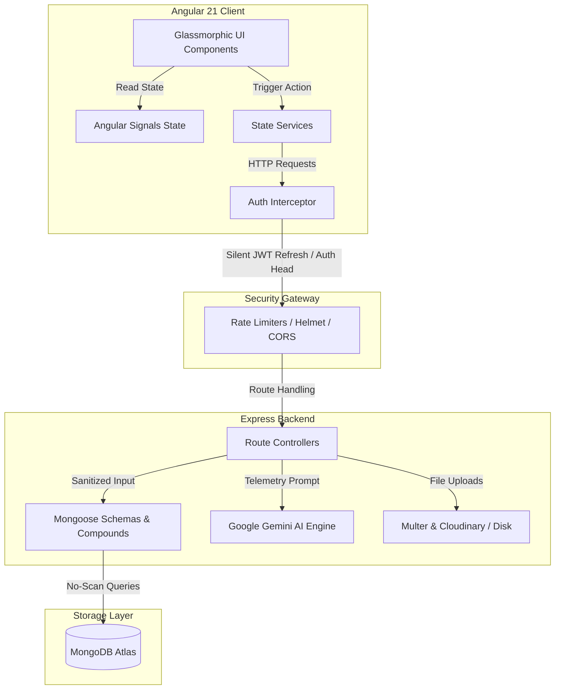

# DrivePulse 🏍️🚗

DrivePulse is a premium, commercial-grade vehicle mileage, trip telemetry, expense budget, and maintenance tracker. It combines a high-fidelity glassmorphic Angular frontend with an Express/MongoDB backend monolith, enhanced with **Google Gemini AI** diagnostics to deliver real-time insights, service projections, and telemetry warnings.

---

## 🌟 Key Features

* **AI Diagnostics & Insights**: Direct integration with Google Gemini (`gemini-2.5-flash`) analyzing vehicle mileage, service history, and expiries to suggest maintenance dues, warning flags, and monthly budgets. Contains a seamless rule-based backup fallback.
* **Fuel Economy & Refuel Logging**: Log refuels with automatic reactive pricing. Displays chronological sparklines representing fuel efficiency changes over time.
* **Travel Stopwatch Journal**: Log journeys with a dynamic riding timer (updating every 10 seconds), GPS route trackers, safety weather parsing, and scenic ride photos.
* **Digital Garage & Document Vault**: Track insurance, PUC, and registration papers. Upload receipt scans to Cloudinary persistently (falls back to local filesystem in dev runs). Generates countdown rings warning of pending expiries.
* **Ownership Expense Tracker**: Budget breakdown lists representing cost distributions (Fuel, Taxes, Repairs) alongside monthly spending forecasts.
* **Scheduler & Maintenance Logs**: Tracks battery life, tyre wear, and chain lubrication wear, degrading based on mileage velocities.
* **Real-time Alert Center**: Translucent slide-out notifications warning of upcoming maintenance and document dates.

---

## 📐 System Architecture & Data Flow

Below is the design representation of the DrivePulse client-server and data ingestion pipelines:



---

## 🛠️ Tech Stack & Advanced Implementation

### Frontend Client

* **Core**: Angular 21 (Standalone Components, Signals State, functional guards/interceptors)
* **Styling**: Tailwind CSS v4, Glassmorphism design tokens, custom SVG graphs, and Material Icons
* **State Management**: Reactive and synchronous UI updates managed entirely via Angular Signals (`signal`, `computed`).
* **Silent JWT Session Recovery**: When an access token expires (generating a `TOKEN_EXPIRED` `401 Unauthorized` error), the functional `authInterceptor` catches the failure, calls `authService.refreshToken()` (sending the refresh token in the body) to receive a new access token, updates local storage, clones the original request with the fresh token, and retries the HTTP call transparently.

### Backend Monolith

* **Runtime**: Node.js & Express Monolith
* **Database**: MongoDB & Mongoose ODM (utilizing compound index keys for zero-scan collections searches)
* **Security & Optimization**: General/auth request rate-limiters, NoSQL Injection blockers (`express-mongo-sanitize`), response Gzip payload compression (`compression`), and production environment validation checkups
* **File Uploads**: Multer with Cloudinary persistent storage integration

---

## ⚙️ Environment Configuration

### Backend Setup

Create a `.env` file inside the `backend/` directory:

```env
PORT=3000
MONGODB_URI=mongodb://127.0.0.1:27017/mileage-tracker
JWT_SECRET=your_super_secret_jwt_key
JWT_REFRESH_SECRET=your_super_secret_refresh_jwt_key
JWT_EXPIRE=15m
JWT_REFRESH_EXPIRE=7d
RATE_LIMIT_WINDOW_MS=900000
RATE_LIMIT_MAX=100
UPLOAD_DIR=uploads

# Cloudinary Integration (For receipt scan persistence)
CLOUDINARY_CLOUD_NAME=your_cloudinary_cloud_name
CLOUDINARY_API_KEY=your_cloudinary_api_key
CLOUDINARY_API_SECRET=your_cloudinary_api_secret

# Google Gemini Integration (For AI predictions and insights)
GEMINI_API_KEY=your_gemini_api_key
```

---

## 🚀 Getting Started

### 1. Prerequisite Installations

Ensure you have **Node.js** (v18+ recommended) and **MongoDB** active on your system.

### 2. Start Backend Monolith

```bash
cd backend
npm install
npm run dev
```

* Access active diagnostics status check at `http://localhost:3000/api/health`

### 3. Start Frontend Client

In a new terminal shell from the root directory:

```bash
npm install
npm run start
```

* Open your browser and navigate to `http://localhost:4200/`

---

## 🧪 Testing & Verification

### Run Backend Unit Tests

To verify the fuel efficiency calculation engines (including full fills, partial fills, and missed mileage resets):

```bash
cd backend
npm run test
```

### Compile Production Build

To audit compile sanity:

```bash
npm run build
```

---

## 📁 Repository Structure

```text
├── backend/                  # Node.js/Express monolith service
│   ├── src/
│   │   ├── config/           # App settings & env checks
│   │   ├── controllers/      # Route controllers (fuel, trips, etc.)
│   │   ├── middleware/       # JWT interceptors, rate-limiters, sanitizers
│   │   ├── models/           # Mongoose schemas & indexes
│   │   ├── routes/           # REST endpoints
│   │   └── utils/            # Calculations engines, Gemini API client
│   └── package.json
├── public/                   # Shared static assets (custom PNG favicon)
├── src/                      # Angular client codebase
│   ├── app/
│   │   ├── components/       # Standalone UI Views & layouts
│   │   ├── guards/           # Navigation auth checkers
│   │   ├── interceptors/     # JWT token append/retry handlers
│   │   └── services/         # State signals controllers
│   └── index.html
├── angular.json              # Angular CLI compiler build configs
└── README.md
```

---

## 🔗 API Endpoint Reference

All endpoints are prefixed with `/api` and require an authorization header (`Bearer <JWT_token>`) except registration and login.

| Module | Route | Method | Payload / Multipart | Description |
| :--- | :--- | :--- | :--- | :--- |
| **Auth** | `/auth/register` | `POST` | `{ name, email, password }` | Registers a new user account |
| | `/auth/login` | `POST` | `{ email, password }` | Authenticates a user & yields access/refresh tokens |
| | `/auth/refresh` | `POST` | `{ refreshToken }` | Refreshes expired JWT access token silently |
| **Vehicles** | `/vehicles` | `GET` / `POST` | `{ brand, model, type, year, startOdometer, currentOdometer }` | Fetch all vehicles or register a new one |
| | `/vehicles/:id` | `PUT` / `DELETE` | `{ brand, model, type, year, currentOdometer }` | Modify or remove a vehicle profile |
| **Fuel Logs** | `/fuel` | `GET` / `POST` | Form-Data: `receipt` (file), `vehicleId`, `odometer`, `liters`, `pricePerLiter`, `partialFill`, `missedPreviousFill` | Retrieve refuels list or log a purchase (multipart file) |
| **Trips** | `/trips/start` | `POST` | `{ vehicleId, startLocation, odometer }` | Starts a new stopwatch ride log |
| | `/trips/:id/end` | `POST` | Form-Data: `photos` (files), `endLocation`, `odometer`, `purpose` | Ends a trip, logs weather, ride score, and files |
| **Expenses** | `/expenses` | `GET` / `POST` | `{ vehicleId, amount, category, date, description }` | Fetch spent logs or document a custom cost |
| **Services** | `/services` | `GET` / `POST` | `{ vehicleId, type, odometer, date, cost, notes }` | List maintenance intervals or add logs |
| **Documents** | `/documents` | `GET` / `POST` | Form-Data: `document` (file), `vehicleId`, `name`, `type`, `expiryDate` | Get uploaded papers or add scans (RC, PUC, Insurance) |
| **Notifications** | `/notifications` | `GET` | — | List notifications center warnings |
| **Analytics** | `/analytics` | `GET` | — | Aggregated dashboard telemetry metrics |

---

## 📐 Mathematical Calculations & AI Weights

### 1. Fuel Mileage (km/L) Formula

To prevent skewed readings from partial fills, DrivePulse pools intermediate entries until a full tank refuel (`type: "full"` or `partialFill: false`) is logged.

* **Mileage Accumulation Algorithm**:
  1. Fuel entries are sorted chronologically by odometer ascending.
  2. For every `partialFill: true` entry, the liters added are accumulated:
     $$\text{Accumulated Liters} = \sum \text{Liters}_{\text{partial}}$$
  3. When a `partialFill: false` (full fill) entry is encountered, mileage is calculated as:
     $$\text{Distance} = \text{Odometer}_{\text{current}} - \text{Odometer}_{\text{lastFullFill}}$$
     $$\text{Total Liters} = \text{Liters}_{\text{current}} + \text{Accumulated Liters}$$
     $$\text{Mileage} = \frac{\text{Distance}}{\text{Total Liters}}$$
  4. If the entry has `missedPreviousFill: true`, the accumulated liters are reset to `0`, no mileage is computed for the current entry (as the chain was broken), and the current entry is saved as the new baseline `lastFullFill`.

---

### 2. Vehicle Health Score Index (0 - 100%)

Computed dynamically by `aiEngine.js` by evaluating the status of documents, logs, and mileage velocity.

$$\text{Health Score} = S_{\text{insurance}} + S_{\text{puc}} + S_{\text{battery}} + S_{\text{tyres}} + S_{\text{fuel}} + S_{\text{service}} + S_{\text{maintenance}}$$

* **Insurance Validity ($S_{\text{insurance}}$ - 5% max)**: Binary check (0% if expired or not logged, 5% if valid).
* **PUC Validity ($S_{\text{puc}}$ - 5% max)**: Binary check (0% if expired or not logged, 5% if valid).
* **Battery Age ($S_{\text{battery}}$ - 5% max)**: Assumes a 24-month lifespan. If battery age is $> 24$ months, score degrades linearly:
  $$S_{\text{battery}} = \max(0, 5 - (\text{Age}_{\text{months}} - 24) \times 0.2)$$
* **Tyre Mileage ($S_{\text{tyres}}$ - 10% max)**: Assumes a 20,000 km lifespan. If distance since change is $> 20,000\text{ km}$:
  $$S_{\text{tyres}} = \max(0, 10 - (\Delta\text{Odometer} - 20000) \times 0.001)$$
* **Fuel Drops ($S_{\text{fuel}}$ - 25% max)**: Compares the average mileage of the last 3 full refuels against historical averages. If the recent average drops below the historical average:
  $$S_{\text{fuel}} = \max(0, 25 - \text{Drop}\% \times 1.5)$$
* **General Service ($S_{\text{service}}$ - 30% max)**: Standard general service interval is 5,000 km or 180 days (6 months).
  $$\text{Penalty}_{\text{km}} = \max(0, \Delta\text{Odometer} - 5000) \times \frac{5}{1000}$$
  $$\text{Penalty}_{\text{days}} = \max(0, \Delta\text{Days} - 180) \times \frac{5}{30}$$
  $$S_{\text{service}} = \max(0, 30 - \max(\text{Penalty}_{\text{km}}, \text{Penalty}_{\text{days}}))$$
* **Chain Lubrication ($S_{\text{maintenance}}$ - 20% max)**: Standard lubrication interval is 500 km or 30 days.
  $$\text{Penalty} = \left(\frac{\max(0, \Delta\text{Odometer} - 500)}{100} \times 4\right) + \left(\frac{\max(0, \Delta\text{Days} - 30)}{7} \times 4\right)$$
  $$S_{\text{maintenance}} = \max(0, 20 - \text{Penalty})$$

---

### 3. AI Predictions & Run-Rate Projections

When Gemini API (`gemini-2.5-flash`) is enabled, these predictions are contextually refined. Otherwise, the engine falls back to standard rule-based algorithms:

* **Daily Distance Velocity ($K_d$)**:
  $$K_d = \frac{\text{Odometer}_{\text{latest}} - \text{Odometer}_{\text{earliest}}}{\text{Days}_{\text{latest}} - \text{Days}_{\text{earliest}}} \quad (\text{defaults to } 15\text{ km/day if } < 2\text{ logs exist})$$
* **Next Service Prediction**: Expected service is targeted at $5,000\text{ km}$ since the last general service. Days remaining is calculated as:
  $$\text{Days Remaining} = \max\left(1, \frac{\text{Odometer}_{\text{target}} - \text{Odometer}_{\text{current}}}{K_d}\right)$$
* **Next Fuel Refill Prediction**: Computes the average distance gap between historical refuels ($G_{\text{avg}}$):
  $$\text{Days Remaining} = \max\left(0, \frac{G_{\text{avg}} - (\text{Odometer}_{\text{current}} - \text{Odometer}_{\text{lastRefuel}})}{K_d}\right)$$
* **Monthly Expense Forecast**: Extrapolates current month expenses using a daily run-rate cost:
  $$\text{Forecast} = \text{Spent This Month} + \left(\frac{\text{Spent This Month}}{\text{Current Day}}\right) \times (\text{Days In Month} - \text{Current Day})$$

---

## 🌐 Vercel Deploy Guide

DrivePulse is optimized for serverless hosting on **Vercel**:

1. Install the Vercel CLI: `npm i -g vercel`
2. Create a `vercel.json` file in the `backend/` root directory to handle API routing:

   ```json
   {
     "version": 2,
     "builds": [
       {
         "src": "src/app.js",
         "use": "@vercel/node"
       }
     ],
     "routes": [
       {
         "src": "/(.*)",
         "dest": "src/app.js"
       }
     ]
   }
   ```

3. Set your production environment variables (MongoDB URI, JWT secret, Cloudinary key, and Gemini key) in your Vercel Dashboard.
4. Deploy the backend: `cd backend && vercel`

---

## 🛠️ Troubleshooting FAQ

### Q1: "MongoDB connection error / Mongoose lockup"

* **Fix**: Ensure your local MongoDB community server is running. You can start it via Windows Services console or by running `mongod` in your terminal. If using a remote replica-set cluster, ensure your IP address is whitelisted in your MongoDB Atlas console.

### Q2: "Gemini API key is not defined / falling back to local"

* **Fix**: If you do not have a Gemini API Key in your `.env` file, the backend will gracefully fallback to Rule-Based diagnostics. You will see warning logs inside the console, but the application will operate correctly. Make sure to define `GEMINI_API_KEY` to enjoy context-aware AI summaries.

### Q3: "Multer: Unexpected field error on file upload"

* **Fix**: Ensure your key name in multipart forms matches exactly: `receipt` for fuel logs, `document` for papers, and `photos` for multiple trip scenic attachments.
